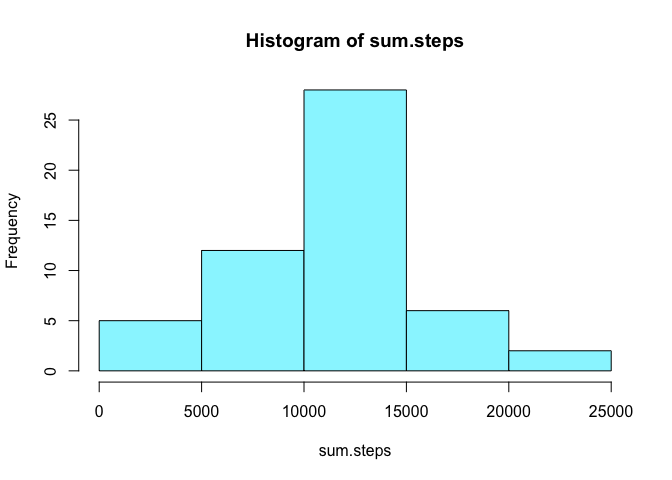
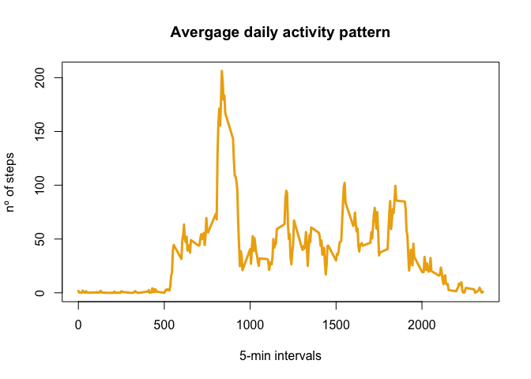
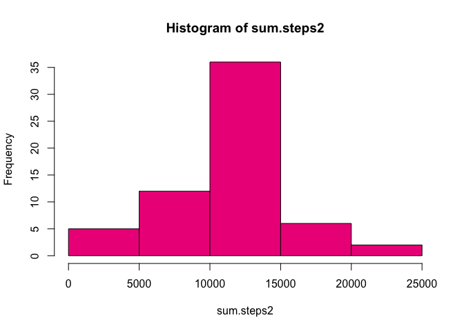
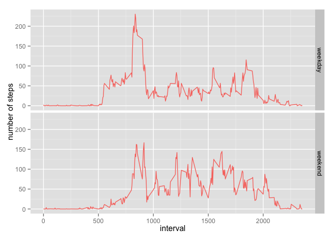

# Reproducible Research: Peer Assessment 1


## Loading and preprocessing the data
The first step consists on reading the data and the needed packages


```r
activity <- read.csv("activity.csv", header=TRUE, sep=",")
library (knitr)
```

Then set the required global options


```r
opts_chunk$set(echo = TRUE)
```

Now I'll take a look at the data


```r
head(activity)
```

```
##   steps       date interval
## 1    NA 2012-10-01        0
## 2    NA 2012-10-01        5
## 3    NA 2012-10-01       10
## 4    NA 2012-10-01       15
## 5    NA 2012-10-01       20
## 6    NA 2012-10-01       25
```

```r
summary(activity)
```

```
##      steps                date          interval     
##  Min.   :  0.00   2012-10-01:  288   Min.   :   0.0  
##  1st Qu.:  0.00   2012-10-02:  288   1st Qu.: 588.8  
##  Median :  0.00   2012-10-03:  288   Median :1177.5  
##  Mean   : 37.38   2012-10-04:  288   Mean   :1177.5  
##  3rd Qu.: 12.00   2012-10-05:  288   3rd Qu.:1766.2  
##  Max.   :806.00   2012-10-06:  288   Max.   :2355.0  
##  NA's   :2304     (Other)   :15840
```


## What is mean total number of steps taken per day?

    Calculate the total number of steps taken per day

```r
sum.steps <- with (activity, tapply(steps, date, sum, na.rm=FALSE))
```

    Make a histogram of the total number of steps taken each day

```r
hist(sum.steps, col="cadetblue1")
```

 

    Calculate and report the mean and median of the total number of steps taken per day

```r
summary(sum.steps)
```

```
##    Min. 1st Qu.  Median    Mean 3rd Qu.    Max.    NA's 
##      41    8841   10760   10770   13290   21190       8
```


## What is the average daily activity pattern?

    Make a time series plot (i.e. type = "l") of the 5-minute interval (x-axis) and the average number of steps taken, averaged across all days (y-axis)

```r
stepsIntervals <- aggregate(steps ~ interval, activity, mean)
plot(stepsIntervals$interval, stepsIntervals$steps, type="l", lwd=3, col= "darkgoldenrod2", main="Avergage daily activity pattern", xlab="5-min intervals", ylab="nº of steps")
```

 

    Which 5-minute interval, on average across all the days in the dataset, contains the maximum number of steps?

```r
stepsIntervals[which(stepsIntervals$steps == max(stepsIntervals$steps)) ,]
```

```
##     interval    steps
## 104      835 206.1698
```


## Imputing missing values

    Calculate and report the total number of missing values in the dataset (i.e. the total number of rows with NAs)

```r
sum(is.na(activity))
```

```
## [1] 2304
```
    
    Devise a strategy for filling in all of the missing values in the dataset. The strategy does not need to be sophisticated. For example, you could use the mean/median for that day, or the mean for that 5-minute interval, etc.
    Create a new dataset that is equal to the original dataset but with the missing data filled in.

```r
noNA <- activity
for (i in stepsIntervals$interval) {
      noNA[noNA$interval == i & is.na(noNA$steps) ,]$steps <-   stepsIntervals$steps[stepsIntervals$interval ==i]
}
```

    Make a histogram of the total number of steps taken each day and Calculate and report the mean and median total number of steps taken per day. Do these values differ from the estimates from the first part of the assignment? What is the impact of imputing missing data on the estimates of the total daily number of steps?

```r
sum.steps2 <- with (noNA, tapply(steps, date, sum))
hist(sum.steps2, col="deeppink2",)
```

 

```r
summary(sum.steps2)
```

```
##    Min. 1st Qu.  Median    Mean 3rd Qu.    Max. 
##      41    9819   10770   10770   12810   21190
```

There are a few changes, mainly the median goes form 10760 yo 10770, wich matches the mean.

## Are there differences in activity patterns between weekdays and weekends?

    Create a new factor variable in the dataset with two levels – “weekday” and “weekend” indicating whether a given date is a weekday or weekend day.

```r
noNA$date <- as.POSIXlt(noNA$date)
noNA$week <- as.factor (ifelse(weekdays(noNA$date) %in% c("sábado", "domingo"), "weekend", "weekday"))
```

    Make a panel plot containing a time series plot (i.e. type = "l") of the 5-minute interval (x-axis) and the average number of steps taken, averaged across all weekday days or weekend days (y-axis). See the README file in the GitHub repository to see an example of what this plot should look like using simulated data.

```r
noNASI <- aggregate(steps ~ interval + week, noNA, mean)
library(ggplot2)
qplot(interval, steps, data=noNASI, facets=week~., type="l", geom = "line", col= "darkgoldenrod2", ylab="number of steps" ) + theme(legend.position='none')
```

 
